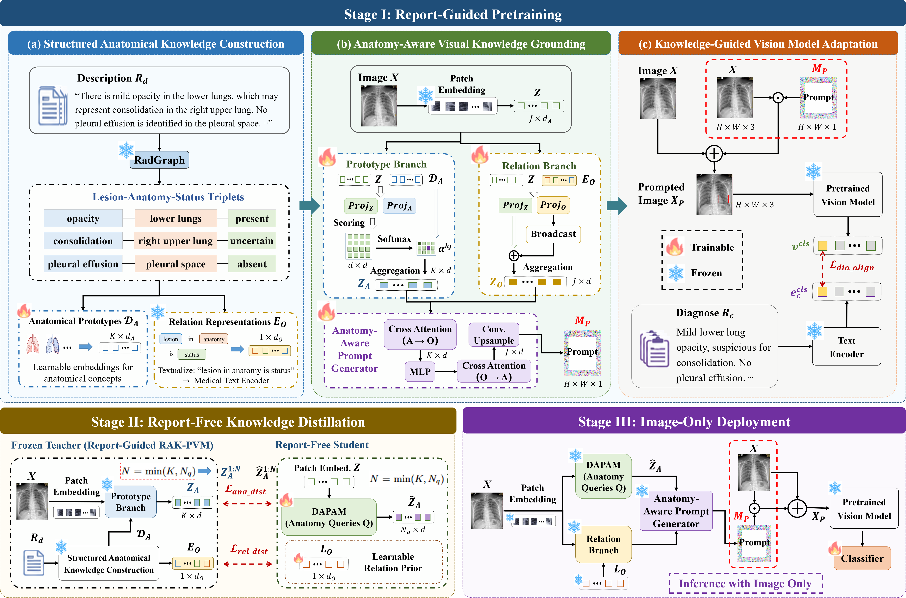

# RAK-PVM
[Report-Derived Anatomical Knowledge for Pretrained Vision Model Adaptation in Chest X-ray Classification]



###  Installation
To clone this repository:
```
git clone https://github.com/yuvaneai/RAK-PVM.git
```
To install Python dependencies:
```
pip install -r requirements.txt
```

### Dataset downloading

Datasets we used are as follows:

* **MIMIC-CXR**: We downloaded the [MIMIC-CXR-JPG](https://physionet.org/content/mimic-cxr-jpg/2.0.0/) dataset as the radiographs. Paired medical reports can be downloaded in [MIMIC-CXR](https://physionet.org/content/mimic-cxr/2.0.0/mimic-cxr-reports.zip).

* **ChestX-Det10**: We downloaded the [ChestX-Det10](https://github.com/wangtao123456/ChestX-Det10) dataset as the chest radiographs.

* **NIH ChestX-ray14**: We downloaded the [NIH ChestX-ray14](https://nihcc.app.box.com/v/ChestXray-NIHCC) dataset as the chest radiographs.

### Data Preprocessing
We preprocessed these datasets and split the dataset into train/test set using the code in `datapreprocess`.

### Pre-training

**Reminder**: Please check the paths in `pretraining_distillation/dataset/pretrain_dataset.py` and `pretrain_module.py` and make sure they are correct.

We pre-trained RAK_PVM on MIMIC-CXR using this command:
```
cd pretraining_distillation/
CUDA_VISIBLE_DEVICES=0 python pretrain_module.py

```
We train our framework 50 epochs on 2 pieces of RTX 3090 GPUs with batch size of 144. It takes about *1 day* to pre-train this mod
